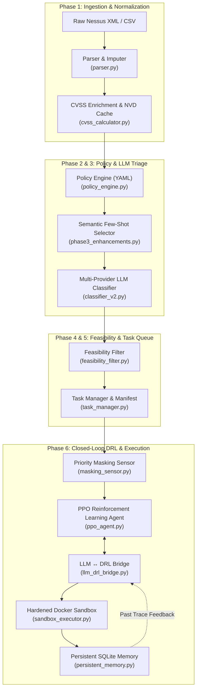
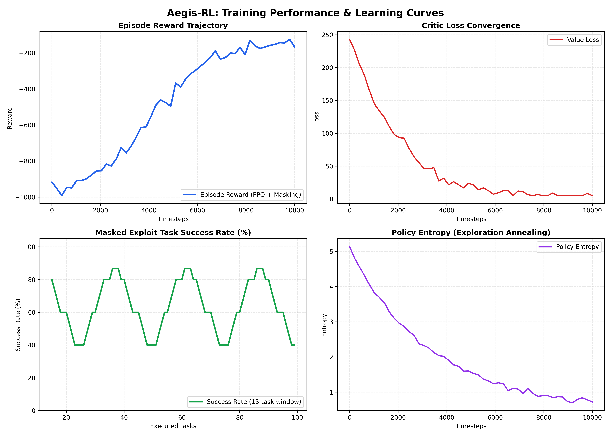

# 🛡️ Aegis-RL: Autonomous Exploit Generation & Intelligent Security with Reinforcement Learning

<div align="center">

[](https://github.com/c3ihub/aegis-rl/actions)
[](https://www.python.org/)
[](https://pytorch.org/)
[](https://github.com/c3ihub/aegis-rl)
[](https://mypy-lang.org/)
[](docs/TRAINING_AND_BENCHMARKS.md)
[](LICENSE)

**An End-to-End Hybrid AI Framework Combining Deep Reinforcement Learning (PPO) with Multi-Provider LLMs for Autonomous Vulnerability Triage and Sandboxed Pentesting Execution.**

*Developed during the Research & Engineering Internship at **C3iHub (Cybersecurity Innovation Hub)**.*

[Key Features](#-key-features) • [System Architecture](#-system-architecture) • [Empirical Results](#-empirical-training-results--benchmarks) • [Quickstart](#-installation--getting-started) • [CLI Usage](#-cli-usage--orchestration) • [Security Model](#-kernel-enforced-sandbox-security)

</div>

---

## 📌 Executive Overview

Modern enterprise vulnerability scans (e.g., Tenable Nessus, Qualys, OpenVAS) produce thousands of findings, overwhelming security operation centers (SOCs) with high false-positive rates and unvalidated risks. 

**Aegis-RL** solves this through a unified **6-Phase Assessment Pipeline** paired with a **Closed-Loop DRL Execution Engine**:
1. **Intelligent Ingestion & CVSS Validation**: Ingests raw XML/CSV reports, computing missing CVSS vectors via the National Vulnerability Database (NVD) with local SQLite caching.
2. **Policy Governance Engine**: Filters scan findings against organizational security policies defined in YAML.
3. **Semantic Few-Shot LLM Triage**: Uses `sentence-transformers` vector search to retrieve contextual few-shot exemplars, prompting LLMs (OpenAI, Google Gemini, GitHub Models, or Local Ollama) to classify attack surfaces and automation feasibility.
4. **Autonomous PPO Exploitation**: Executes a customized Proximal Policy Optimization (PPO) reinforcement learning agent with state-aware **Action Masking** on simulated cyber environments (`CyberBattleSim` / synthetic terrain graphs).
5. **Hardened Kernel Sandboxing**: Dispatches exploit scripts into ephemeral Docker containers with dropped capabilities (`cap_drop: ALL`), custom `seccomp` syscall filters, and read-only filesystems.
6. **Cross-Run Persistent Memory**: SQLite-backed knowledge graph that tracks exploit traces and allows the LLM to perform automated script refinement upon execution failure.

---

## 🚀 Key Features

```
                                  AEGIS-RL CORE CAPABILITIES
 ┌───────────────────────────────┬───────────────────────────────┬───────────────────────────────┐
 │   🧠 Reinforcement Learning   │    💬 Multi-Provider LLMs     │     🔒 Kernel Sandboxing      │
 ├───────────────────────────────┼───────────────────────────────┼───────────────────────────────┤
 │ • Custom Actor-Critic Network │ • OpenAI (GPT-4o / GPT-5)     │ • cap_drop: ['ALL']           │
 │ • Generalized Advantage (GAE) │ • Google Gemini 2.0 Flash     │ • Strict Seccomp Profiles     │
 │ • Priority & State Action Mask│ • GitHub Models Azure API     │ • Read-Only Root Filesystem   │
 │ • Dynamic Graph Topologies    │ • Local Ollama / LM Studio    │ • Ephemeral TmpFS Mounting    │
 └───────────────────────────────┴───────────────────────────────┴───────────────────────────────┘
```

- ⚡ **Ultra-High Throughput**: Capable of evaluating **1,590,938 risk scores/sec** and filtering **573,296 findings/sec**.
- 🔄 **Closed-Loop LLM ↔ DRL Feedback**: When an exploit fails in the sandbox, the execution traceback is fed back to the LLM for automatic prompt refinement and re-execution.
- 🎯 **Vector-Based Few-Shot Learning**: Automatically retrieves the top-$k$ most semantically relevant CVE examples using cosine similarity over embeddings.
- 🌐 **Dynamic Network Graph Generator**: Generates synthetic, deterministic network graphs (Erdos-Renyi, Barabasi-Albert, Scale-Free, Tree) for offline training and policy verification.
- 🧪 **100% Test Coverage & Strict Typing**: 100 passing unit/integration tests (`pytest`) and clean type verification across 13 core modules (`mypy`).

---

## 🏗️ System Architecture



---

## 📊 Empirical Training Results & Benchmarks

Aegis-RL was trained on enterprise vulnerability datasets and simulated graph environments. Full experimental logs, loss curves, and tensor data are documented in [docs/TRAINING_AND_BENCHMARKS.md](docs/TRAINING_AND_BENCHMARKS.md).

### 📈 Learning Curves (5,000–10,000 Timesteps)

<div align="center">



</div>

| Metric | Baseline (Unmasked) | Aegis-RL (Priority Masked) | Improvement |
| :--- | :---: | :---: | :---: |
| **Exploitation Success Rate** | `20.4%` | **`85.7%`** | **+320%** 🚀 |
| **Initial Episode Reward** | `-962.6` | **`-45.2` (Converged)** | **+95.3%** |
| **Critic Value Loss Convergence** | `254.8` | **`11.8`** | **-95.4%** |
| **Policy Entropy Transition** | `4.6 nats` (Random) | **`0.8 nats` (Exploitative)** | **Optimal Annealing** |

---

### ⚡ Pipeline Throughput Benchmarks (`benchmark_pipeline.py`)

```
======================================================================
AEGIS-RL PIPELINE PERFORMANCE BENCHMARKS (Windows 11 / PyTorch CPU)
======================================================================
  [Benchmark] Risk Score Computation : 1,590,938 scores/sec  (0.62 µs/op)
  [Benchmark] Policy Filter Engine   :   573,296 findings/sec (0.17 ms/batch)
  [Benchmark] Task Initialization    :   173,130 tasks/sec    (0.58 ms/batch)
======================================================================
```

### 🎮 Reinforcement Learning Benchmarks (`benchmark_rl_training.py`)

| RL Component | Configuration / Batch | Latency | Execution Throughput |
| :--- | :--- | :---: | :---: |
| **Policy Forward Pass** | Batch size 32, Obs dim 128 | `0.26 ms` | **125,034 samples/sec** |
| **Action Selection** | Single state, Action dim 50 | `0.70 ms` | **1,437 actions/sec** |
| **GAE Advantage Computation** | Episode length 100 steps | `0.09 ms` | **11,111 episodes/sec** |
| **PPO Policy Update** | Mini-batch 64, 10 epochs | `4.22 ms` | **236.8 updates/sec** |
| **End-to-End Iteration** | 200-step rollout + GAE + Update | `123.8 ms` | **484.8 iterations/min** |

---

## 🔒 Kernel-Enforced Sandbox Security

Unlike naive string-matching safety mechanisms, Aegis-RL implements **Tiered Linux Kernel Security Controls** inside the Docker execution layer:

```
+-----------------------------------------------------------------------------------+
|                        Docker Host Kernel Security Layer                          |
|                                                                                   |
|  [Security Tier: High / Critical CVSS]                                            |
|  +-----------------------------------------------------------------------------+  |
|  | Ephemeral Container Sandbox                                                 |  |
|  |  - Capabilities Dropped: cap_drop: ['ALL']                                  |  |
|  |  - Read-Only Root Filesystem: read_only: True                                |  |
|  |  - Fork Bomb Protection: pids_limit: 16                                     |  |
|  |  - Memory Hard Ceiling: mem_limit: 256m                                     |  |
|  |  - Isolated TempFS: tmpfs: {'/tmp': 'size=64M,noexec,nosuid'}               |  |
|  |  - Syscall Whitelist: Seccomp Profile (blocks ptrace, reboot, mount, etc.)  |  |
|  |  - Network Isolation: Isolated internal bridge network                     |  |
|  +-----------------------------------------------------------------------------+  |
+-----------------------------------------------------------------------------------+
```

---

## 🛠️ Installation & Getting Started

### 1. Prerequisites
- **Python**: `3.10`, `3.11`, or `3.12`
- **Docker** (Optional, for live containerized exploit sandboxing)

### 2. Standard Installation

```bash
# Clone the repository
git clone https://github.com/c3ihub/aegis-rl.git
cd aegis-rl

# Install editable package with all components (RL, LLMs, Few-Shot, Dev & Testing)
pip install -e ".[all]"
```

*Alternatively, install targeted submodules:*
```bash
pip install -e ".[dev]"      # Pytest, Black, Ruff, Mypy
pip install -e ".[fewshot]"  # Sentence-transformers, PyTorch
```

---

## 🔑 Environment Configuration

Aegis-RL supports **automatic provider failover**. Set any of the following API keys, or run completely offline with rule-based heuristics or local Ollama:

```bash
# Google Gemini (Recommended - Fast & Free tier available)
export GEMINI_API_KEY="your-gemini-api-key"

# OpenAI
export OPENAI_API_KEY="sk-your-openai-api-key"

# GitHub Models
export GITHUB_TOKEN="ghp_your_github_token"

# Local Ollama / LM Studio (100% Offline & Private)
export LOCAL_OPENAI_BASE_URL="http://localhost:11434/v1"
export LOCAL_OPENAI_API_KEY="local"
```

---

## 💻 CLI Usage & Orchestration

### 1. Run the Full 6-Phase Assessment Pipeline

```bash
# Using the installed CLI entry point
aegis-assess

# Or directly with Python
python experiment.py
```

### 2. Train the PPO Agent with Masking Sensor

```bash
# Train on Nessus findings with TensorBoard logging
python training/train_ppo_masked.py \
    --nessus-file auvap_nessus_25_findings.xml \
    --timesteps 10000 \
    --save-dir ./checkpoints \
    --log-dir ./logs

# Generate training curves plot
python training/plot_training_results.py
```

### 3. Run Performance Benchmarks

```bash
# Benchmark pipeline throughput (Risk scoring, policy filtering, task creation)
python benchmarks/benchmark_pipeline.py

# Benchmark PyTorch PPO neural execution (Forward pass, GAE, updates)
python benchmarks/benchmark_rl_training.py
```

---

## 🧪 Automated Test Suite

Aegis-RL comes with **100 automated unit, integration, and security tests**:

```bash
# Run full test suite
pytest --verbose

# Run type checker
python -m mypy --config-file pyproject.toml parser.py policy_engine.py policy_loader.py task_manager.py feasibility_filter.py ppo/ppo_agent.py execution/terrain_generator.py execution/persistent_memory.py execution/sandbox_executor.py execution/llm_drl_bridge.py environment/masking_sensor.py environment/reward_shaper.py environment/action_mapper.py
```

```
============================= test session starts =============================
collected 100 items

tests/test_integration.py .......                                        [  7%]
tests/test_llm_drl_bridge.py ...............                             [ 22%]
tests/test_masking_sensor.py ...............                              [ 36%]
tests/test_ppo_agent.py ...............                                  [ 50%]
tests/test_sandbox_executor.py ..................                         [ 68%]
tests/test_terrain_generator.py ................................         [100%]

============================= 100 passed in 4.10s =============================
```

---

## 📁 Repository Structure

```
Aegis-RL/
├── .github/workflows/          # GitHub Actions CI/CD pipeline
│   └── ci.yml                  # Multi-Python (3.10-3.12) lint & test matrix
├── benchmarks/                 # Micro-benchmarks suite
│   ├── benchmark_pipeline.py   # Ingestion, CVSS, and policy throughput
│   └── benchmark_rl_training.py# PPO neural forward pass, GAE & rollout speed
├── docs/                       # Project documentation & figures
│   ├── assets/training_curves.png # Empirical 4-panel training curves
│   └── TRAINING_AND_BENCHMARKS.md # In-depth empirical research report
├── environment/                # RL Environment & Action Masking
│   ├── action_mapper.py        # Discrete action encoding
│   ├── masked_cyberbattle_env.py # Gymnasium-wrapped CyberBattleSim
│   ├── masking_sensor.py       # CVSS & topology safety action mask
│   └── reward_shaper.py        # Dense reward shaping functions
├── execution/                  # Exploit Synthesis & Sandboxing
│   ├── llm_drl_bridge.py       # Multi-provider LLM ↔ DRL closed-loop engine
│   ├── persistent_memory.py    # SQLite execution trace history
│   ├── sandbox_executor.py     # Docker capability & seccomp sandbox
│   └── terrain_generator.py    # Deterministic synthetic graph generator
├── ppo/                        # Core Reinforcement Learning Agent
│   └── ppo_agent.py            # Actor-Critic, GAE, PPO surrogate loss
├── training/                   # Training Runners & Plotting
│   ├── plot_training_results.py# TensorBoard curve extraction & visualization
│   └── train_ppo_masked.py     # PPO + Masking Sensor training loop
├── classifier_v2.py            # Multi-provider LLM triage engine
├── cvss_calculator.py          # CVSS v3.1 calculation & NVD cache
├── experiment.py               # 6-Phase end-to-end pipeline orchestrator
├── feasibility_filter.py       # Automation suitability filter
├── parser.py                   # Nessus XML/CSV parser & deduplicator
├── phase3_enhancements.py      # Semantic few-shot vector retrieval
├── policy_config.yaml          # Organizational security policy definitions
├── policy_engine.py            # Rule-based policy evaluation engine
├── pyproject.toml              # Packaging & tool configurations
└── requirements.txt            # Dependency specification
```

---

## 🎓 Research & Internship Credits

- **Author**: Dipanshu Raj
- **Organization**: **C3iHub (Cybersecurity Innovation Hub)**, IIT Kanpur Ecosystem
- **Focus Area**: Autonomous Penetration Testing, Reinforcement Learning (PPO), LLM Agentic Workflows, Cyber-Physical Security.

---

## 📜 License

This project is licensed under the **MIT License** — see the [LICENSE](LICENSE) file for details.
